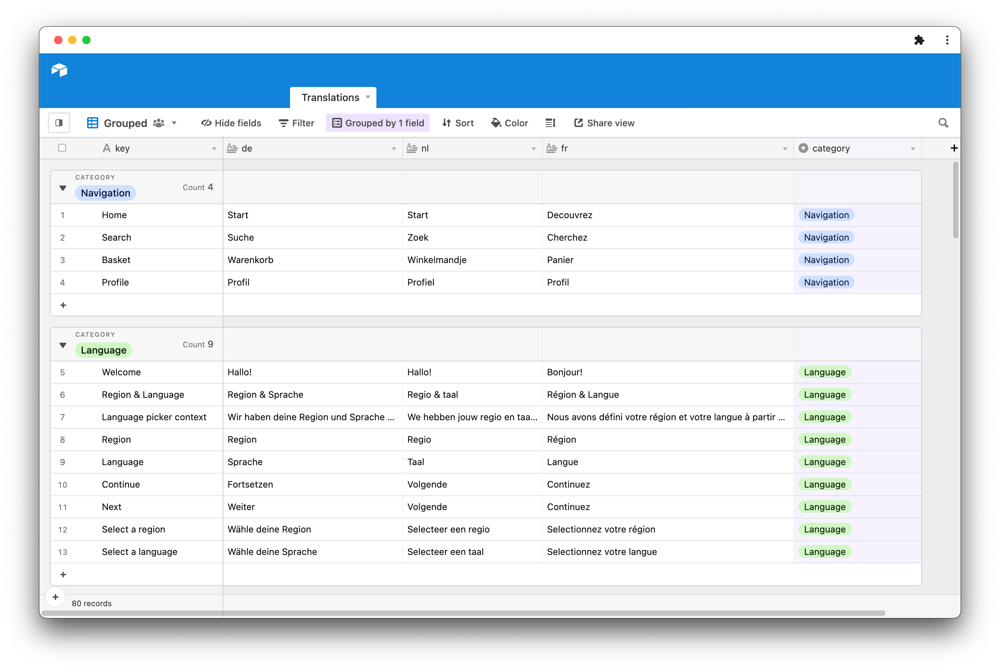

# Translations

A hook which loads the translations from an external source and initializes i18next.

## Getting started

`yarn add @bothrs/translations`

## Usage

```
import { useTranslations } from '@bothrs/translations
```

`useTranslations` return a boolean which indicates if the translations are loaded. This can be used to [hide the splashscreen](https://docs.expo.dev/versions/latest/sdk/splash-screen/).

```
const translationsLoaded = useTranslations({
    expirationTime: 60 * 1000,
    startupLanguage: 'en',
    loadPath: airtableUrl + '/Translations' + '?api_key=' + airtableKey,
})


```

import all the supported languages from `intl` in the entry point of your app (`app.tsx`)

```
import 'intl'

import 'intl/locale-data/jsonp/de'
import 'intl/locale-data/jsonp/nl'
import 'intl/locale-data/jsonp/fr'
```

## Airtable

For now, airtable is the only supported data-source of `@bothrs/translations`.

The base should have the folowing columns

| column name        | mandatoruy | explanation                                                                                 |
| ------------------ | ---------- | ------------------------------------------------------------------------------------------- |
| key                | true       | the key that will be used in the [i18next t method](https://www.i18next.com/overview/api#t) |
| en / nl / fr / ... | true       | the iso code of the supported languages                                                     |
| category           | false      |  We recommomend to use a category column to group related records in airtable               |

### Example Airtable base


